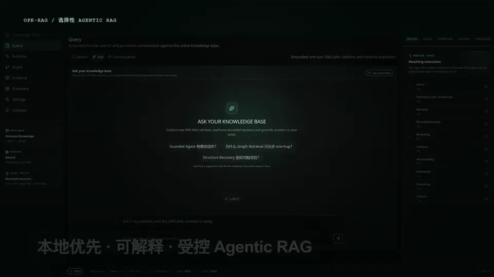
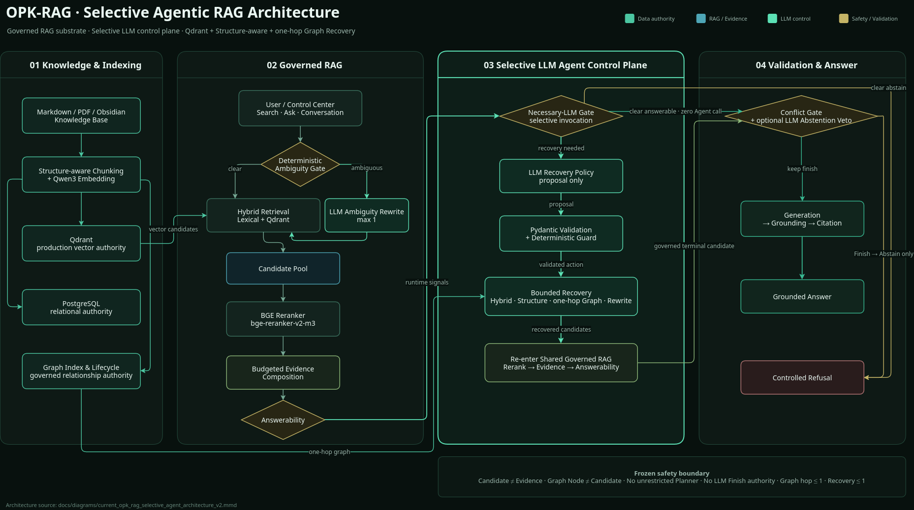
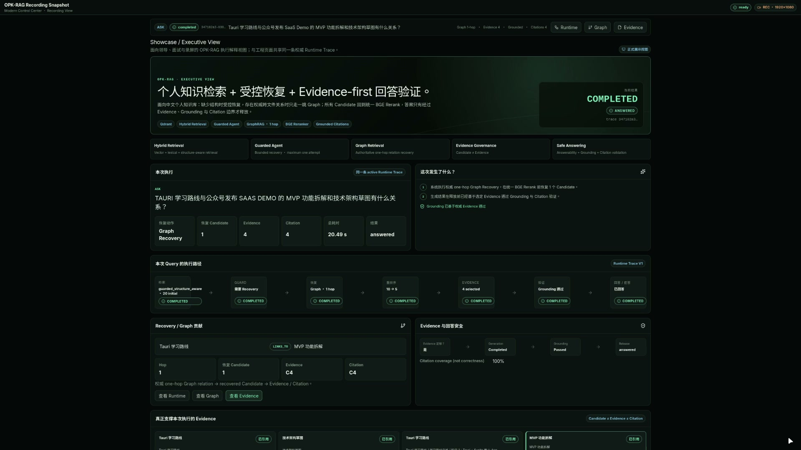

<div align="center">

# 🧠 OPK-RAG

### Selective Agentic RAG for Personal Knowledge Bases

A local-first AI assistant architecture for Obsidian-style knowledge bases with controlled agent recovery, evidence governance, and grounded generation.

[Showcase](#showcase-video) · [Architecture](#架构) · [Demo](#modern-control-center) · [Quick Start](#quick-start)

</div>

# OPK-RAG

**中文个人知识库 Selective Agentic RAG**<br>
Local-first Chinese Knowledge RAG with Qdrant, Structure-aware Retrieval, bounded one-hop Graph Recovery, Selective LLM Agent, Evidence Governance and Runtime Trace.

> 这是一个面向个人 Markdown / PDF / Obsidian 知识库的工程型 RAG 项目。重点不是“向量检索 + LLM”Demo，而是把 **Retrieval → Recovery → Rerank → Evidence → Answerability → Grounding/Citation → Refusal** 做成可观察、可评估、可回滚的受治理链路。

[快速开始](docs/QUICK_START.md) · [公开发布策略](docs/OPEN_SOURCE_RELEASE.md) · [安全策略](SECURITY.md) · [贡献指南](CONTRIBUTING.md)


## Why OPK-RAG?

Traditional RAG systems often follow a fixed pipeline:

```text
Query → Retrieve → Generate
```

OPK-RAG introduces a controlled Selective Agentic workflow:

```text
Query
 ↓
Retrieval
 ↓
Evidence Evaluation
 ↓
Selective Agent Gate
 ↓
Bounded Recovery
 ↓
Grounded Answer
```

The Agent does not replace retrieval. It operates inside a constrained action space with deterministic guards, evidence validation, and fail-closed behavior.

## 30 秒理解

- **Qdrant**：生产向量候选检索 authority；PostgreSQL 保留文档/Chunk/Graph/会话等 relational authority，pgvector 是回滚后端。
- **Structure-aware + one-hop Graph Recovery**：恢复是条件触发且有预算的，不是每个 Query 都扩图。
- **Selective LLM Agent**：Necessary-LLM Gate 只在需要时调用模型；LLM 输出是 proposal，仍需 Pydantic/Deterministic Guard；不宣称 unrestricted Planner 或直接 Finish authority。
- **Candidate ≠ Evidence**：所有 Initial/Recovery Candidate 都回到统一 BGE Reranking / Evidence / Answerability 链路。
- **Runtime Trace + Modern Control Center**：Retrieval、Candidate、Graph、Evidence、Grounding/Citation 可沿同一 authoritative trace 检查。

## Showcase Video

<p align="center">
  <a href="https://github.com/Thesoul20/opk-rag-public/releases/download/v0.1.1/showcase-video-v2.1-visual-delta-candidate.mp4">
    
  </a>
</p>

<p align="center">
  <strong>README 内直接预览完整 73 秒 V2.1 流程</strong><br>
  <a href="https://github.com/Thesoul20/opk-rag-public/releases/download/v0.1.1/showcase-video-v2.1-visual-delta-candidate.mp4"><strong>1080p MP4</strong></a>
  ·
  <a href="https://github.com/Thesoul20/opk-rag-public/releases/tag/v0.1.1">GitHub Release</a>
</p>

这支最终展示片使用真实 Showcase V3 / Runtime Trace 证据，重点演示普通确定性路径、Necessary-LLM 条件选择、受控 Graph Recovery、Deterministic Guard，以及 Candidate → Evidence → Citation → Grounding 的治理链路。

> **LLM 提供语义能力，确定性规则保留系统控制权。**

`README preview: animated WebP · 960×540 · 5 FPS · full 73 s`<br>
`Master: H.264 · 1920×1080 · 30 FPS · 73 s · Chinese-first · no audio`


## Design Principles

### Retrieval First

The system retrieves and evaluates evidence before generation.

### Controlled Agency

The Agent proposes bounded recovery actions instead of unrestricted planning.

### Evidence Grounding

Candidates are transformed into validated evidence before answering.

### Fail Closed

Invalid decisions, unsafe recovery paths, or insufficient evidence fall back safely.

## 架构



- [Editable Draw.io](docs/diagrams/current_opk_rag_selective_agent_architecture_v2.drawio)
- [Mermaid source](docs/diagrams/current_opk_rag_selective_agent_architecture_v2.mmd)
- [中文架构图](docs/diagrams/current_opk_rag_selective_agent_architecture_v2_zh.png)

## Modern Control Center



Control Center 是运行时可观测与展示层，不拥有独立的 Retrieval / Agent / Graph / Answer 决策权。它沿同一个 `opk-rag.runtime-trace.v1` 展示 Query → Retrieval → Guard/Recovery → Rerank → Evidence → Validation → Answer/Refuse。

当前首页 Showcase 使用已完成视觉可观测性验收与 Owner review 的 V2.1 版本。README 采用完整 73 秒 animated WebP 内联预览，1080p MP4 继续保持不进入 Git history，而是作为公开 GitHub Release asset 发布；首页入口见上方 [Showcase Video](#showcase-video)。

## GitHub Preview

The repository landing page is designed around a clear portfolio flow:

- Architecture overview
- Runtime Control Center demonstration
- Verified metrics
- Quick Start and technical documentation

Social preview design guidance is documented in [docs/GITHUB_SOCIAL_PREVIEW.md](docs/GITHUB_SOCIAL_PREVIEW.md).

## Demo Flow

```text
User Query

↓

Hybrid Retrieval

↓

Evidence Evaluation

↓

Necessary-LLM Gate

↓

Recovery Decision

↓

Answer Generation / Refusal
```

该流程展示 OPK-RAG 的核心原则：LLM Agent 不替代 Retrieval，而是在受控边界内参与 Recovery Proposal 与 Abstention Veto。

## 已验证结果

以下只列可追溯到冻结 artifact 的指标；公开版汇总见 [`release/evidence/verified_metrics.json`](release/evidence/verified_metrics.json)。

| 指标 | 结果 | 边界 |
| --- | ---: | --- |
| Graph-sensitive required evidence recall | **0.667 → 0.944** | 9 个 formal graph-sensitive units |
| 多轮语义评测 | **37/40 = 92.5%** | 40/40 runtime success；hard safety violation 0 |
| BGE Reranker P95 | **53.43 → 27.61 ms (-48.3%)** | Search-scoped FP16 autocast；不是完整 Search 延迟 |
| Top-1 / Top-5 agreement | **100% / 100%** | FP32 vs FP16 reranker comparison |
| Qdrant backend-only P95 | **3.08 ms** | 47-query local single-node benchmark |

不把 backend-only 延迟表述成端到端 RAG 延迟，也不宣称“hallucination free”、不承诺绝对正确，也不声称 unrestricted production Agent activation。

## Quick Start

```bash
uv sync --dev
cp .env.public.example .env
docker compose -f infra/public/docker-compose.yml up -d
```

应用迁移、索引项目自带的公开 synthetic demo corpus，然后 Search：

```bash
uv run python - <<'PY'
import os
from opk_rag.runtime.dotenv import load_project_env
from opk_rag.db.migrations import apply_all_migrations
load_project_env()
apply_all_migrations(os.environ["DATABASE_URL"])
PY

uv run opk-rag index examples/public-demo --format json
uv run opk-rag search \
  --knowledge-base-id <knowledge-base-uuid> \
  --query "Qdrant 和 PostgreSQL 分别负责什么？" \
  --format json
```

完整步骤、可选 Ask Provider 和 Control Center 启动方式见 **[docs/QUICK_START.md](docs/QUICK_START.md)**。

## 仓库地图

```text
opk_rag/           Core runtime + governed helper modules
showcase-ui/       React / TypeScript Modern Control Center
supabase/          PostgreSQL schema migrations
infra/public/      Public local PostgreSQL/Qdrant compose reference
examples/          Project-authored public demo corpus
release/evidence/  Curated, machine-readable verified metrics
docs/              Public architecture / Quick Start / release docs
scripts/           Operational and release-governance utilities
tests/             Regression tests; public smoke lane under tests/public
```

开发仓库还保留大量历史 `tasks/` / `evaluation-data/` 作为研发治理证据，但**它们不是 Public Release Snapshot 的组成部分**。详见 [公开发布策略](docs/OPEN_SOURCE_RELEASE.md)。

## Public / Private Boundary

**The public release contains the RAG system, not the author's private knowledge base.**

公开发布不包含：
- 私有 Markdown/PDF/Obsidian Vault；
- `.env` / API key / DB credential；
- PostgreSQL dump / Qdrant storage / model cache；
- model weights；
- 未完成再分发审查的第三方原始 parser corpus；
- raw desktop/OBS material、Provider scratchpad、Chain-of-Thought；
- Git-ignored raw/final MP4。

`examples/public-demo/` 是专门为公开版本编写的 synthetic demo corpus。

## 项目边界

```text
multi_tenant_support=false
unrestricted_autonomous_agent=false
unbounded_multi_hop_graph=false
graph_max_hop=1
recovery_max_attempts=1
ui_decision_authority=false
```

Selective LLM Agent 已完成受控实现与评测；本 README **不声称 unrestricted Production Agent activation**。

## Public Release Snapshot

开发历史中存在不适合直接公开的历史机器路径与第三方 parser 实验材料，因此正式公开使用白名单快照，而不是直接公开完整开发 Git history：

```bash
uv run python scripts/export_public_release.py --output dist/opk-rag-public-release
```

导出器会执行 secret / identity / private-data / large-binary 检查并生成 manifest。详见 [docs/OPEN_SOURCE_RELEASE.md](docs/OPEN_SOURCE_RELEASE.md)。

## License / Third Party

OPK-RAG-authored source与 public demo material 使用 **MIT License**。第三方依赖、模型和服务保留各自许可证/条款；本项目不重新分发模型权重。详见 [docs/THIRD_PARTY.md](docs/THIRD_PARTY.md)。

## Installation

Recommended environment:
- Python 3.11+
- uv package manager
- Optional GPU acceleration

## Configuration

Configure embedding models, reranker, LLM provider, and vector database through environment settings.

## Contributing

Issues, feature requests, and pull requests are welcome. Please read CONTRIBUTING.md before submitting changes.

## Roadmap

Completed:
- Hybrid Retrieval
- Structure-aware Retrieval
- Guarded Agent
- Public Release

Future:
- More Agent Evaluation
- More UI Features
- Community Extensions

## Releases

Latest Release: v0.1.1
